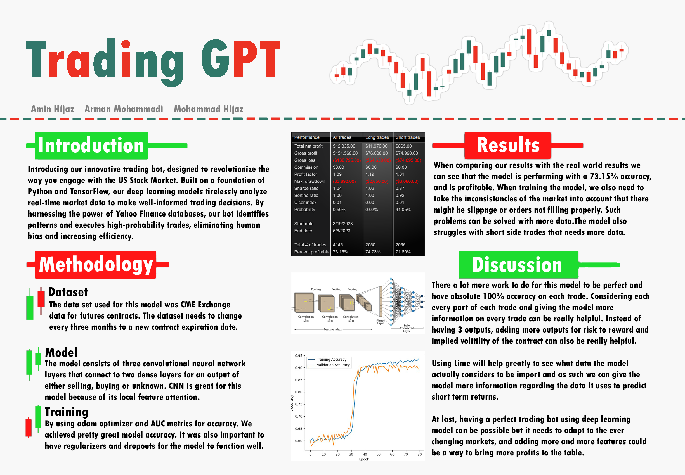

# Deep-learning-Final-Project-Trading-bot

# Members:
Amin Hijaz, Arman Mohammadi, Mohammad Hijaz

# Poster:

# Introduction:
Inspiration
After Experiencing trading and analyzing the US Stock Market, we found out that spending long hours going through the charts and analyzing them manually is very time-consuming work and because of human bias can be very inefficient. We were inspired to create a solution to take out human emotions and bring faster efficiency by using deep learning models.

What it does
Our project is a trading bot that uses deep learning models to analyze real-time markets and make trading decisions. it is great at identifying patterns and uses them to make high-probability trades.

How we built it
We are using Python and TensorFlow to build our deep-learning models. For data, we use Yahoo Finance databases that store one-minute data fluctuations in the stock market during market open hours.

Challenges we ran into
Making a deep learning model that understands and finds patterns is not an easy task. Because of other influences like news and bigger investment banks, it is easy for the model to mislabel a trade and do poorly.

Accomplishments that we're proud of
From the patterns we have found till now, the success rate is 82% with 1000 trainable parameters which is a great risk to reward and will allow us to make a better and more complex model after we clean our data and perform other models.

What we learned
Our understanding of deep learning models grew and we found out the real use cases of such models in the real world.

What's next for Trading bot
Making an API and user interface for the people and allowing other people to train their own models easier when they want to find out if a pattern is profitable pattern or not.

# Related Work:
Nowadays, all the investment firms and banks use deep learning models and algorithms to gain an edge, and make profits. They use models that are trained on specific movements of the markets or to analyze the news and visual inputs to Sell or Buy certain stocks.

# Data:
The data that we are using is public data that everyone can have access to from Yahoo Finance and Yahoo Finance API. This data is stored for different timeframes. The data that we are using is 1-minute data for Stock market Futures contracts. The data shows the open, close, high, low, and volume of the one-minute interval of the stock market.

# Methodology:
There are many different ways to train this trading bot with different models. Since there are many different algorithms and models already running on the stock market, we can leverage that to understand what models work best for our purposes. Currently, We are using CNN models, and we will also experiment with Transformers.

# Metrics:
The success of this trading bot is measured by how many of the trades taken are profitable and what risk-to-reward ratio the trading bot uses for each trade.

# Ethics:
This project has a great cause to learn from the data and maybe help other people to take a leap in their trading journey and become better traders. To measure the success of this model, we can completely rely on its performance on the real-time stock market and see how it performs.

# Distribution of labor:

Arman is focusing on data processing and labeling while also helping with different models and using different algorithms to calculate the accuracy and loss function. Mohammad and Amin will also Optimize the data and the models that we will implement for the trading bot. There will be an equal contribution on each of the tasks for implementing this trading bot.